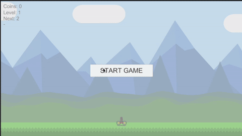

# Ball Blast

A dynamic arcade-style ball shooting game where you defend against falling stones using an upgraded turret system.



## 🎮 Game Overview

Ball Blast is an engaging arcade game where players control a turret to shoot and destroy falling stones. As you progress through levels, the challenge increases with more stones, different sizes, and strategic gameplay elements.

## ✨ Features

### Core Gameplay
- **Dynamic Stone Spawning**: Stones fall from multiple spawn points with varying sizes (Small, Normal, Big, Huge)
- **Stone Splitting Mechanics**: Larger stones break into smaller ones when destroyed, creating cascading destruction
- **Progressive Difficulty**: Each level increases in complexity with more stones and different size distributions
- **Level-Based Scaling**: Stone amounts scale dynamically based on current level (Level 1, 3, 6 parameters)

### Upgrade System
- **Fire Rate Upgrades**: Increase shooting speed
- **Damage Upgrades**: Boost projectile damage
- **Projectile Amount Upgrades**: Shoot multiple projectiles simultaneously
- **Coin-Based Economy**: Collect coins from destroyed stones to purchase upgrades

### Power-ups & Bonuses
- **Freeze Bonus**: Temporarily freeze all stones
- **Invincibility Bonus**: Make the cart immune to stone collisions
- **Random Spawning**: Bonuses spawn randomly when stones are destroyed

### UI & Progress
- **Real-time Progress Tracking**: Shows percentage of stones destroyed (including splits)
- **Level Information**: Displays current and next level
- **Coin Display**: Shows current coin balance
- **Upgrade Interface**: Interactive upgrade buttons with cost display

## 🎯 How to Play

1. **Start the Game**: Click the start button to begin
2. **Control the Turret**: The turret automatically targets and shoots at stones
3. **Collect Coins**: Destroy stones to collect coins for upgrades
4. **Upgrade Wisely**: Use coins to upgrade your turret's capabilities
5. **Survive**: Avoid letting stones hit your cart
6. **Progress**: Complete levels to advance to higher difficulties

## 🏗️ Technical Architecture

### Core Systems
- **Stone Management**: Dynamic spawning, splitting, and destruction
- **Progress Tracking**: Real-time calculation including stone splits
- **Event System**: Decoupled communication between systems
- **Persistence**: Save/load system for coins, upgrades, and level progress

### Key Components
- `StoneSpawner`: Manages stone spawning with level-based scaling
- `LevelState`: Tracks game state and progress
- `UpgradeManager`: Handles upgrade logic and persistence
- `CoinManager`: Manages coin economy with event system
- `UIManager`: Central UI controller

## 🎨 Game Mechanics

### Stone Types
- **Small**: Basic stone, no splitting
- **Normal**: Splits into 2 Small stones
- **Big**: Splits into 2 Normal stones
- **Huge**: Splits into 2 Big stones (Level 5+)

### Level Progression
- **Levels 1-4**: Normal and Big stones only
- **Levels 5+**: Includes Huge stones
- **Dynamic Scaling**: Stone amounts interpolate between level milestones

### Upgrade Costs
- Base cost increases with each upgrade level
- Strategic resource management required

## 🚀 Getting Started

1. Open the project in Unity
2. Ensure all dependencies are installed
3. Open the main scene
4. Press Play to start the game

## 📁 Project Structure

```
Scripts/
├── Core/
│   ├── Stone.cs                 # Stone behavior and splitting
│   ├── StoneSpawner.cs          # Dynamic stone spawning
│   ├── StoneMovement.cs         # Stone physics and movement
│   └── LevelState.cs            # Game state management
├── UI/
│   ├── UIManager.cs             # Main UI controller
│   └── UpgradeUIManager.cs      # Upgrade interface
├── Systems/
│   ├── CoinManager.cs           # Coin economy
│   ├── UpgradeManager.cs        # Upgrade system
│   └── BonusManager.cs          # Power-up system
└── Components/
    ├── Turret.cs                # Player turret
    ├── Cart.cs                  # Player cart
    └── Projectile.cs            # Projectile behavior
```

## 🎮 Controls

- **Automatic Targeting**: Turret automatically aims and shoots
- **UI Navigation**: Click buttons for upgrades and level progression
- **No Manual Input**: Focus on strategic upgrade decisions

## 🏆 Victory Conditions

- Destroy all stones in the level
- Progress through increasingly challenging levels
- Maximize coin collection for optimal upgrades

## 🎯 Defeat Conditions

- Any stone collides with the player's cart
- Game over screen appears with restart option

---

*Enjoy the strategic challenge of Ball Blast!*